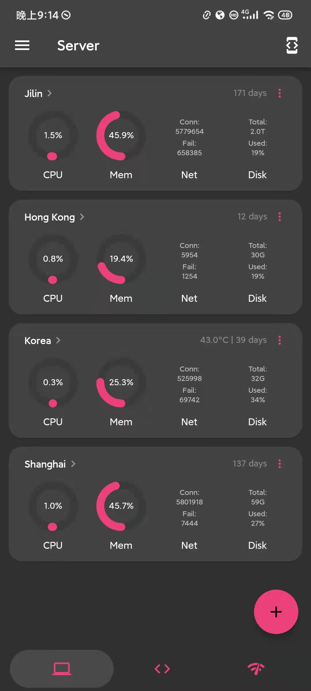
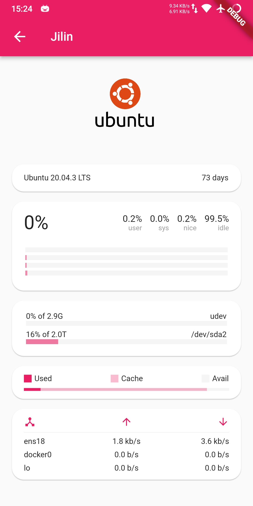
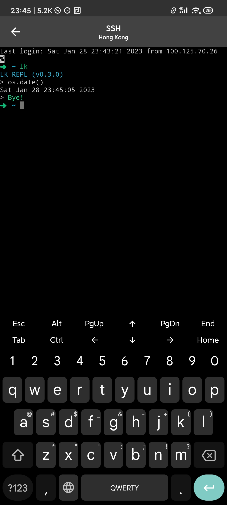
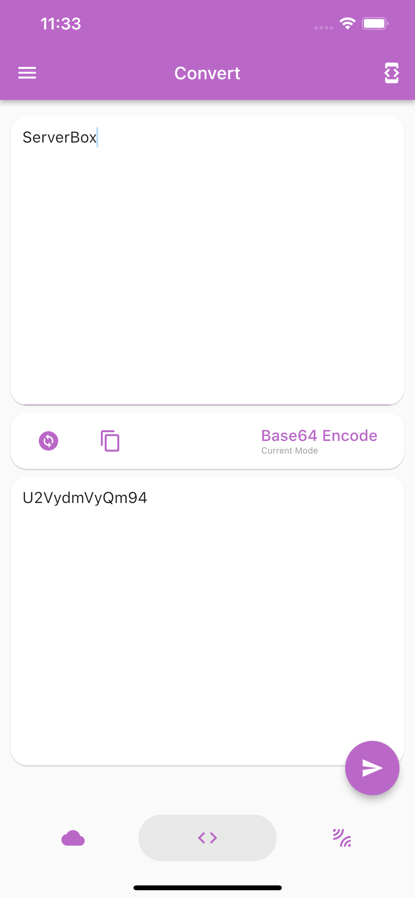

<!-- Title-->

  <h1 align="center">Server Box</h1>

<!-- Badges-->

  
  

A Flutter project which provide charts to display server status and tools to manage server.
 
Especially thanks to <a href="https://github.com/TerminalStudio/dartssh2">dartssh2</a> & <a href="https://github.com/TerminalStudio/xterm.dart">xterm.dart</a>.

## 🔖 Feature
- [x] Functions
  - [x] `SSH` Terminal
  - [x] `Docker & Pkg` Manager
  - [x] `SFTP`
  - [x] `Snippet`
  - [x] `Ping`
  - [x] Status charts
  - [x] etc.
- [x] i18n (English, Chinese), **welcome contribution** :)
- [x] Desktop support

## 📱 ScreenShots
<table>
  <tr>
    <td>
	    
    </td>
    <td>
	    
    </td>
    <td>
	    
    </td>
    <td>
	    
    </td>
  </tr>
</table>
<table>
  <tr>
    <td>
	    
    </td>
    <td>
	    
    </td>
    <td>
	    
    </td>
    <td>
	    
    </td>
  </tr>
</table>

## 🖥 Platform
Status|Platform          
--- | ---
Full Support|Android/iOS
Support, but not tested|macOS/Windows/Linux

## 📝 License
`GPL v3. lollipopkit 2023`
