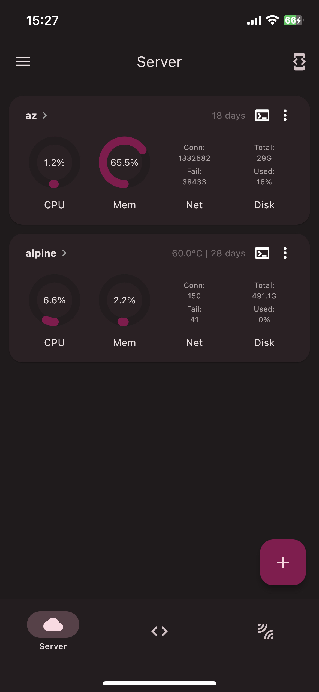
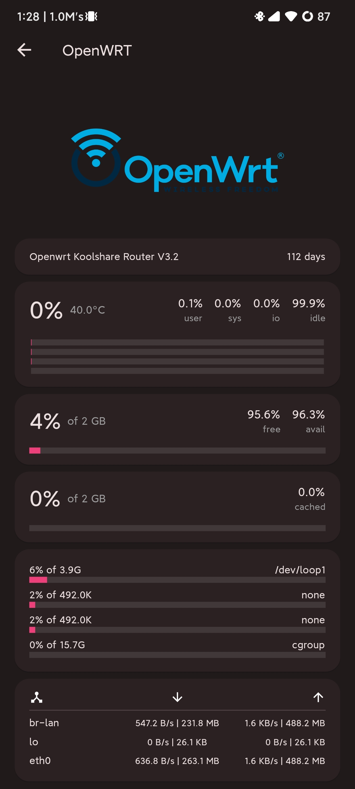
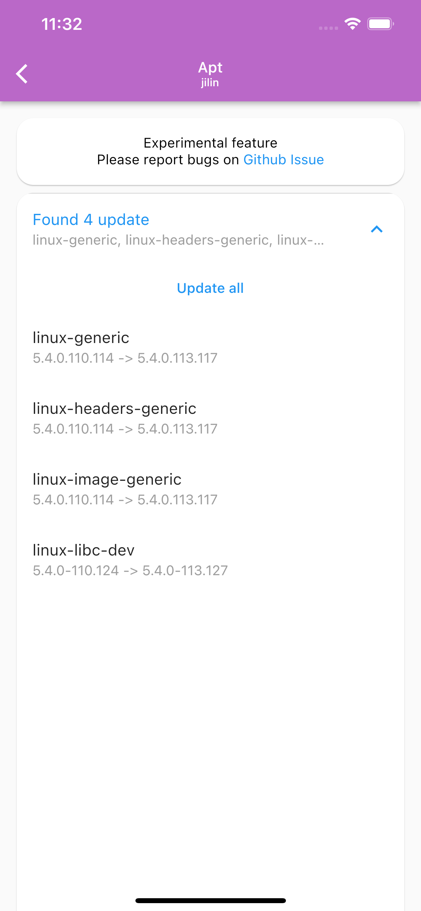
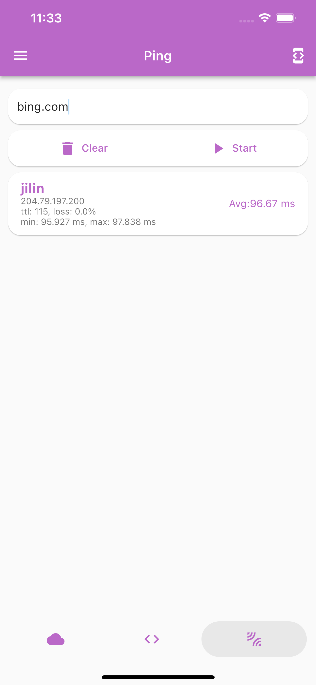
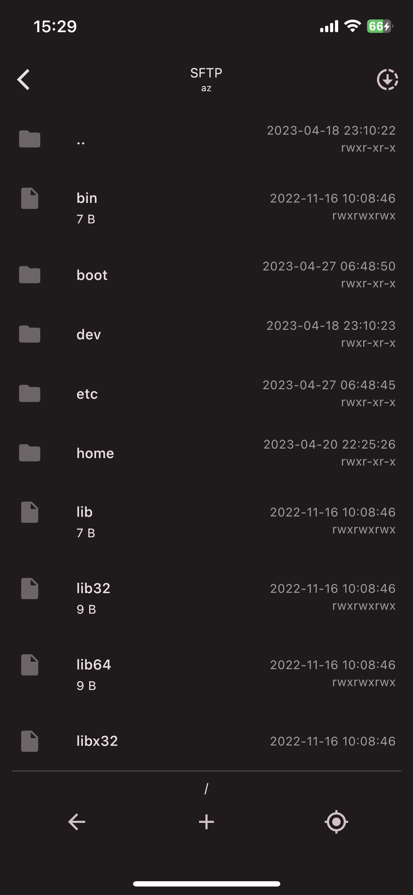
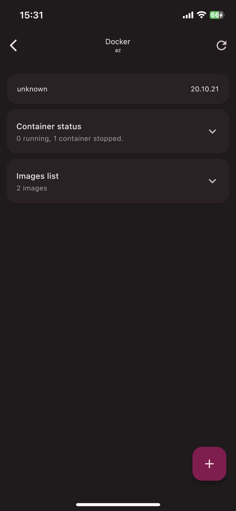

English | [简体中文](README_zh.md)
<!-- Title-->

  

<!-- Badges-->

  
  
  

A Flutter project which provide charts to display <a href="../../issues/43">Linux</a> server status and tools to manage server.
 
Especially thanks to <a href="https://github.com/TerminalStudio/dartssh2">dartssh2</a> & <a href="https://github.com/TerminalStudio/xterm.dart">xterm.dart</a>.

## 🔖 Feature
- [x] Functions
  - [x] `SSH` Terminal, `SFTP`
  - [x] `Docker & Pkg` Manager
  - [x] Status charts
  - [x] `Ping` and etc.
- [x] i18n (English, 简体中文, Deutsch)
  - Welcome contribution :), [How to contribute?](#l10n-guide)
- [x] Desktop support

## 📩 Push
In order to push  server status to your portable device without opening ServerBox app, you need to install [ServerBoxMonitor](https://github.com/lollipopkit/server_box_monitor) on your servers, and config `iOS / Webhook / ServerChan`.

## 🆘 Help
If you have any question or feature request, please open a [discussion](https://github.com/lollipopkit/flutter_server_box/discussions/new/choose).  
If ServerBox app has any bug, please open an [issue](https://github.com/lollipopkit/flutter_server_box/issues/new).

## 📱 ScreenShots
<table>
  <tr>
    <td>
	    
    </td>
    <td>
	    
    </td>
    <td>
	    
    </td>
    <td>
	    
    </td>
  </tr>
</table>
<table>
  <tr>
    <td>
	    
    </td>
    <td>
	    
    </td>
    <td>
	    
    </td>
    <td>
	    
    </td>
  </tr>
</table>

## 🖥 Platform
Status|Platform          
--- | ---
Full Support| Android / iOS / macOS
Support, but not tested| Windows / Linux

## l10n guide
1. Fork this repo and clone forked repo to your local machine.
2. Create `arb` file in `lib/l10n/` directory
   - File name should be `intl_XX.arb`, where `XX` is the language code. Such as `intl_en.arb` for English and `intl_zh.arb` for Chinese.
3. Add content to the file. You can refer to `intl_en.arb` and `intl_zh.arb` for the format.
4. Run `flutter gen-l10n` to generate files.
5. Pull commit to your forked repo.
6. Request a pull request on my repo.

## 📝 License
`GPL v3. lollipopkit 2023`
