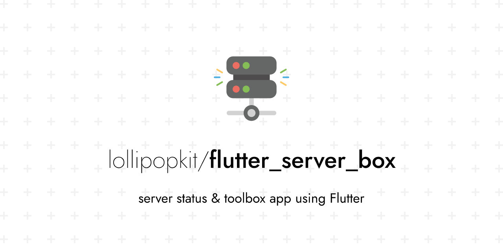
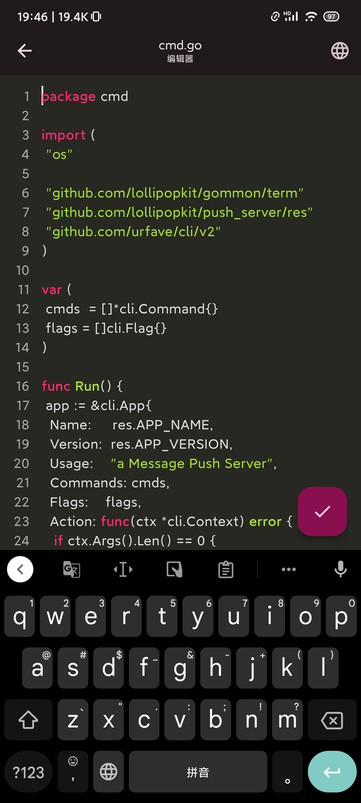

简体中文 | [English](README.md)
<!-- Title-->

  

<!-- Badges-->

  
  
  

使用 Flutter 开发的 <a href="../../issues/43">Linux</a> 服务器工具箱，提供服务器状态图表和管理工具。
 
特别感谢 <a href="https://github.com/TerminalStudio/dartssh2">dartssh2</a> & <a href="https://github.com/TerminalStudio/xterm.dart">xterm.dart</a>.

## 🔖 特点
- [x] 功能
  - [x] `SSH` 终端, `SFTP`
  - [x] `Docker & 包` 管理器
  - [x] 状态图表
  - [x] 代码编辑器
  - [x] `Ping` 和 更多
- [x] 本地化 ( English, 简体中文, Deutsch, 繁體中文, Indonesian。 [如何贡献？](#l10n))
- [x] 桌面端支持

## 📩 推送
为了可以在不使用 ServerBox app 时获取服务器状态（例如：桌面小部件、推送服务），你需要在你的服务器上安装 [ServerBoxMonitor](https://github.com/lollipopkit/server_box_monitor)，并且正确配置，详情可见 [Wiki](https://github.com/lollipopkit/server_box_monitor/wiki/%E4%B8%BB%E9%A1%B5)。

## 🆘 帮助
如果你有任何问题或者功能请求，请在 [讨论](https://github.com/lollipopkit/flutter_server_box/discussions/new/choose) 中交流。  
如果 ServerBox app 有任何 bug，请在 [问题](https://github.com/lollipopkit/flutter_server_box/issues/new) 中反馈。

## 📱 截屏
<table>
  <tr>
    <td>
	    
    </td>
    <td>
	    
    </td>
    <td>
	    
    </td>
    <td>
	    
    </td>
  </tr>
</table>
<table>
  <tr>
    <td>
	    
    </td>
    <td>
	    
    </td>
    <td>
	    
    </td>
    <td>
	    
    </td>
  </tr>
</table>

## 🖥 平台
状态|平台         
--- | ---
完整支持 | Android / iOS / macOS
可能支持，未测试 | Windows / Linux

## 🧱 贡献
**任何正面的贡献都欢迎**.
第一次参与贡献，会赠送 10 份 iOS App 兑换码。这是我唯一能送的。你可以用来送给其他人。:)

### l10n
1. Fork 本项目，并 Clone 你 Fork 的项目至你的电脑
2. 在 `lib/l10n/` 文件夹内创建 `.arb` 本地化文件
   - 文件名应该类似 `intl_XX.arb`,  `XX` 是语言标识码。 例如 `intl_en.arb` 是给英语的， `intl_zh.arb` 是给中文的
3. 向 `.arb` 本地化文件添加内容。 你可以查看 `intl_en.arb` 和 `intl_zh.arb` 的内容，并理解其含义，来创建新的本地化文件
4. 运行 `flutter gen-l10n` 来生成所需文件
5. Commit 变更到你的 Fork 的 Repo
6. 在我的项目中发起 Pull Request.

## 📝 License
1. 允许打包自用，但不允许分发（举例：你可以教别人如何打包，避免花钱购买App，但不能与他人分享你打包的App）
2. 除去上诉情形：遵循 `GPLv3`
