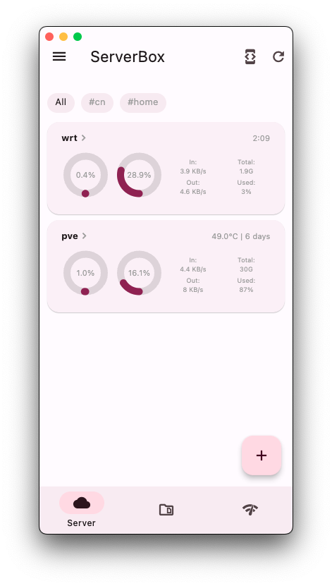
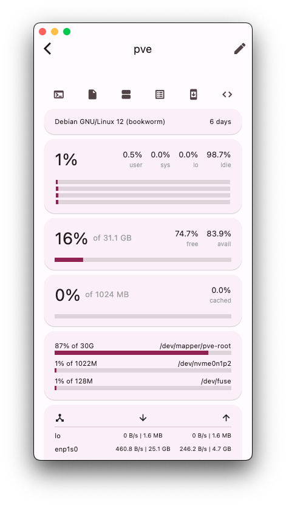
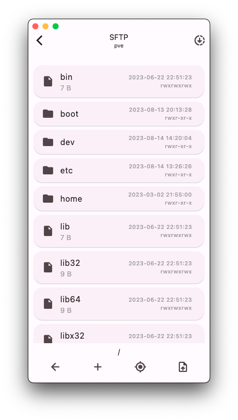
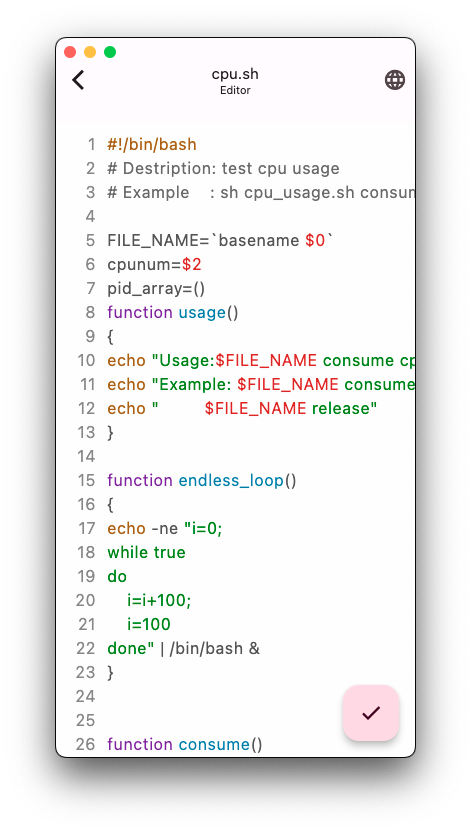
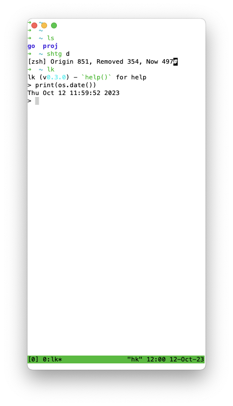
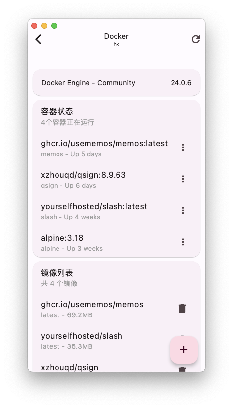

简体中文 | [English](README.md)

<!-- Title-->

  

<!-- Badges-->

  
  
  

使用 Flutter 开发的 <a href="../../issues/43">Linux</a> 服务器工具箱，提供服务器状态图表和管理工具。
 
特别感谢 <a href="https://github.com/TerminalStudio/dartssh2">dartssh2</a> & <a href="https://github.com/TerminalStudio/xterm.dart">xterm.dart</a>。

- [🔖 特点](#-特点)
- [🏙️ 截屏](#️-截屏)
- [⬇️ 下载](#️-下载)
- [🆘 帮助](#-帮助)
- [🧱 贡献](#-贡献)
  - [🌍 l10n](#-l10n)
- [📝 协议](#-协议)

## 🔖 特点
- [x] 功能
  - [x] `SSH` 终端, `SFTP`, `Docker & 包 & 进程` 管理器, 状态图表, 代码编辑器...
  - [x] 特殊支持：`生物认证`、`推送`、`桌面小部件`、`watchOS App`、`跟随系统颜色`...
- [x] 本地化 ( English, 简体中文, Deutsch, 繁體中文, Indonesian。 [如何贡献？](#l10n))
- [x] 全平台支持（除 `Web`）

## 🏙️ 截屏
<table>
  <tr>
    <td>
	    
    </td>
    <td>
	    
    </td>
    <td>
	    
    </td>
  </tr>
</table>
<table>
  <tr>
    <td>
	    
    </td>
    <td>
	    
    </td>
    <td>
	    
    </td>
  </tr>
</table>

## ⬇️ 下载
平台 | 支持 | 签名
:-: | :-: | :-:
[iOS](https://apps.apple.com/app/id1586449703) / [Android](https://res.lolli.tech/serverbox/latest.apk) / [macOS](https://apps.apple.com/app/id1586449703) | 完整 | 个人可信签名
[Linux](https://res.lolli.tech/serverbox/latest.AppImage) / [Windows](https://res.lolli.tech/serverbox/latest.win.zip) | 未测试 | Flutter 默认签名

- 由于中国政策原因，且**目前**无法完成[备案](https://github.com/lollipopkit/flutter_server_box/discussions/180)。iOS 端现已转为免费，请移步 AppStore 其他区下载。
- 关于安全：
  - 为了防止注入攻击等因素，请勿从不可信来源下载。
  - 由于 `Linux / Windows` 使用了默认签名，因此建议**自行构建**。

## 🆘 帮助
- 如果想要反馈问题 吹水 参与开发，QQ群 762870488
- 为了可以在不使用 ServerBox app 时获取服务器状态（例如：桌面小部件、推送服务），你需要在你的服务器上安装 [ServerBoxMonitor](https://github.com/lollipopkit/server_box_monitor)，并且正确配置，详情可见 [wiki](https://github.com/lollipopkit/server_box_monitor/wiki/%E4%B8%BB%E9%A1%B5)。
- **常见问题**可以在 [app wiki](https://github.com/lollipopkit/flutter_server_box/wiki/主页) 查看。
- 如果你有**任何问题或者功能请求**，请在 [讨论](https://github.com/lollipopkit/flutter_server_box/discussions/new/choose) 中交流。
- 如果 ServerBox app 有**任何 bug**，请在 [问题](https://github.com/lollipopkit/flutter_server_box/issues/new) 中反馈，并且附带**完整的 Log 页截图**（点主界面右上角按钮进入）。

## 🧱 贡献
**任何正面的贡献都欢迎**。

### 🌍 l10n
1. Fork 本项目，并 Clone 你 Fork 的项目至你的电脑
2. 在 `lib/l10n/` 文件夹内创建 `.arb` 本地化文件
   - 文件名应该类似 `intl_XX.arb`,  `XX` 是语言标识码。 例如 `intl_en.arb` 是给英语的， `intl_zh.arb` 是给中文的
3. 向 `.arb` 本地化文件添加内容。 你可以查看 `intl_en.arb` 和 `intl_zh.arb` 的内容，并理解其含义，来创建新的本地化文件
4. 运行 `flutter gen-l10n` 来生成所需文件
5. Commit 变更到你 Fork 的 Repo
6. 在我的项目中发起 Pull Request

## 📝 协议
`GPL v3 lollipopkit 2023`
