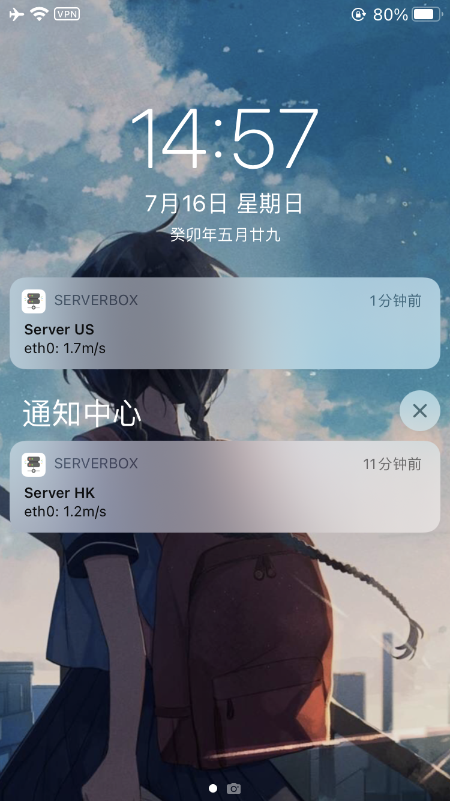
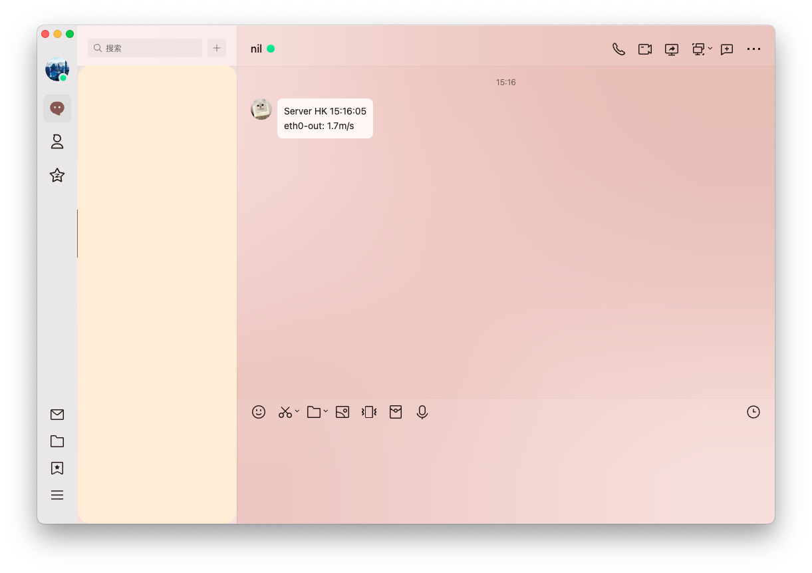
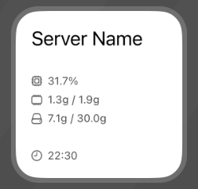

English | [简体中文](README_zh.md)

## ServerBox Monitor
This app runs on server end and monitors the server status.  
It is a part of [ServerBox](https://github.com/lollipopkit/flutter_server_box) project.  
**It's under active development, you may need to reconfig it after upgrading.**

## 🖥️ Screenshots
<table>
  <tr>
    <td>
	    <h5 align="center">iOS push</h5>
    </td>
    <td>
	    <h5 align="center">Webhook push (QQ)</h5>
    </td>
    <td>
	    <h5 align="center">iOS widget</h5>
    </td>
  </tr>
  <tr>
    <td>
	    
    </td>
    <td>
	    
    </td>
    <td>
	    
    </td>
  </tr>
</table>

## 📖 Usage
Please goto [Wiki](https://github.com/lollipopkit/server_box_monitor/wiki) for more information.

## 🔐 Remote access (optional, off by default)

Two WebSocket endpoints can reach this machine's SSH service. Both are
disabled until you turn them on in `config.toml`, and neither can be enabled
from the panel — see `[remote_access]` in `config.example.toml`.

**`[remote_access.tunnel] enabled`** lets the ServerBox app reach SSH over the same HTTPS
endpoint it already polls, for hosts whose SSH port isn't reachable directly.
Everything the app does over SSH then works: terminal, SFTP, containers,
processes, and port forwarding. The agent only moves bytes — the SSH session is
negotiated end to end between app and sshd, the app verifies the host key
itself, and this process could not read the session even if it tried. There is
no target parameter: the agent connects to `ssh_addr` and nothing else, which
is what stops it being usable to reach other hosts on its network. To reach a
second machine, configure it in the app with this one as its jump server, so
that hop is authorised by SSH rather than by the agent.

**`[remote_access.terminal] enabled`** adds an in-browser terminal to the panel. The agent acts
as an SSH client to `ssh_addr`, so a session has exactly the privileges of the
SSH account the browser signs in as — the panel password alone grants no shell,
and sshd's own logging, `AllowUsers` and two-factor prompts all still apply.
Sessions survive a dropped connection for a few minutes, so a phone changing
networks rejoins the same shell instead of losing it.

**`full_access`** removes the SSH login step: anyone signed into the panel can
open a shell, run a command and reach any address this machine can reach, all
as the account the agent runs as. Unset follows the platform — on for Linux,
off for macOS and Windows. **Your panel password then buys the machine**, which
is why `install.sh` installs a *user* systemd service by default; if you run
the agent as root, turn this off. The SSH login stays available alongside it.
Also settable with `SBM_FULL_ACCESS=0/1`, and the panel's first-run prompt can
turn it off — never on.

It is one switch rather than one per feature because there is only one decision
in it: anyone who can open a shell can run anything in that shell and connect
anywhere from it, so granting the terminal and withholding the rest withholds
nothing.

Notes:

- The terminal refuses to run on a plaintext listener, because its first
  message carries an SSH password. TLS satisfies this; so does a reverse proxy
  on the same host, since loopback traffic can't be read off the network.
  `[remote_access.terminal] allow_insecure = true` overrides it. The tunnel is unaffected — what it
  carries is already encrypted.
- The agent pins the host key of the sshd it connects to on first use and
  refuses a changed one, rather than re-pinning silently. Clearing the pin is
  deliberate: delete the row from `ssh_known_hosts`.
- `access_log` records who opened what, from where, and whether it worked. It
  never records a credential.
- Failed logins are throttled per source address and per username.

## 🔖 License
`GPL v3. lollipopkit 2023`