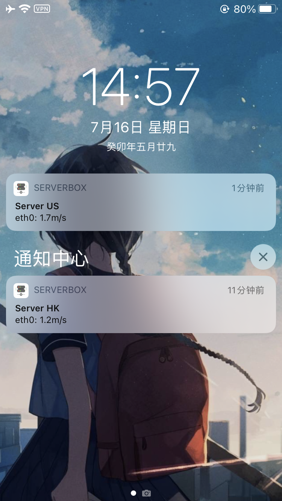
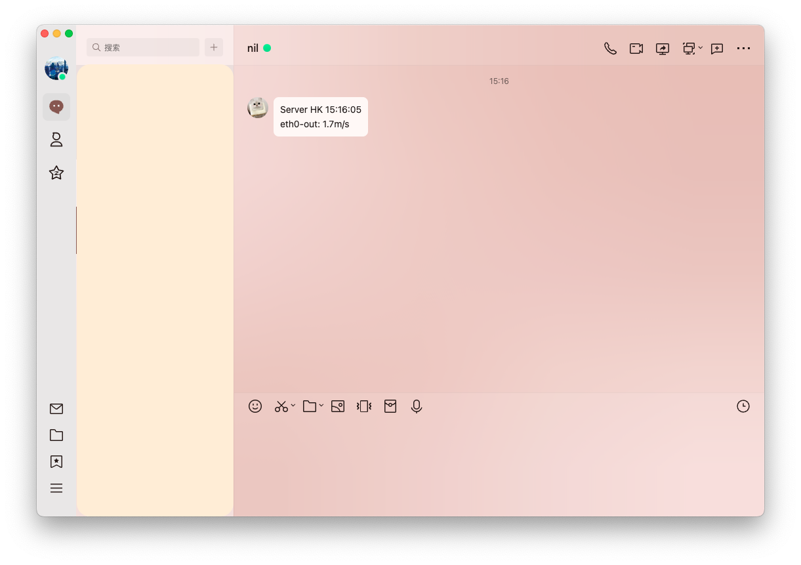
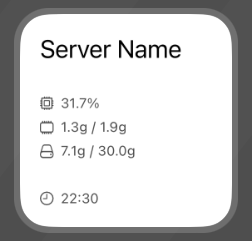

[English](README.md) | 简体中文

# ServerBox Monitor

ServerBox Monitor 是
[ServerBox](https://github.com/lollipopkit/flutter_server_box) 的服务端 agent，
负责记录服务器指标、提供 Monitor HTTP API，并在需要时托管网页面板。
不同版本之间可能会调整配置格式，升级后请重新检查 `config.example.toml`。

## 🖥️ 截图
<table>
  <tr>
    <td>
	    <h5 align="center">iOS 推送</h5>
    </td>
    <td>
	    <h5 align="center">Webhook 推送 (QQ)</h5>
    </td>
    <td>
	    <h5 align="center">iOS 桌面部件</h5>
    </td>
  </tr>
  <tr>
    <td>
	    
    </td>
    <td>
	    
    </td>
    <td>
	    
    </td>
  </tr>
</table>

## 安装和运行

```sh
# systemd: 安装为 `systemctl --user` 服务, 以你自己的账号运行
curl -fsSL https://raw.githubusercontent.com/lollipopkit/flutter_server_box/main/monitor/install.sh | sh -s -- install

# OpenRC (Alpine): 写 /etc/init.d 需要 root, 但 agent 仍以你 sudo 前的账号运行
curl -fsSL https://raw.githubusercontent.com/lollipopkit/flutter_server_box/main/monitor/install.sh | sudo sh -s -- install

# 两种 init 系统, 都以 root 运行
curl -fsSL https://raw.githubusercontent.com/lollipopkit/flutter_server_box/main/monitor/install.sh | sudo sh -s -- install --system

# admin 账号初始不带任何权限, 之后在 App 或面板中开启 (默认是 --permissions full)
curl -fsSL https://raw.githubusercontent.com/lollipopkit/flutter_server_box/main/monitor/install.sh | sh -s -- install --permissions read

# 没有可下载的 release 时 —— 离线, 或使用未发布的构建
curl -fsSL https://raw.githubusercontent.com/lollipopkit/flutter_server_box/main/monitor/install.sh | SBM_INSTALL_PKG=/path/to/server-box-monitor sh -s -- install
```

`sh -s --` 之后的都是传给脚本的参数, `uninstall` 和 `upgrade` 同理。脚本本身
也在本仓库里, 从 checkout 执行 `./install.sh install` 效果相同。

`install.sh install` 会下载本仓库最新的 `monitor-v*` release。release 由
`monitor-release.yml` workflow 发布，该 workflow 仅支持 `workflow_dispatch`；
若尚无对应 release，请用 `SBM_INSTALL_PKG` 指向本地构建的包，或使用
[Docker](Dockerfile)。

配置文件是二进制旁边的 `config.toml`。所有配置项及其注释都在
[`config.example.toml`](config.example.toml) 里；`cargo run -- config` 会打印
解析后的值。agent 默认监听 `0.0.0.0:3770`，当 `frontend/dist` 存在时同时在该
地址提供面板。

### ServerBox App 需要开启什么

在 App 里以 **monitor** 方式添加的服务器，只通过这个 agent 的 HTTP API 访问，
不携带任何 SSH 凭据。agent 在 `GET /api/v1/capabilities` 上报它接受什么，App
就只提供什么：

| App 功能 | 权限 |
|---|---|
| 状态、图表、历史曲线 | 无，任意账号都可以 |
| 进程、systemd、容器、snippet、电源、App 终端 | `shell`（`POST /api/v1/exec`、`/api/v1/terminal/ws`） |
| 文件浏览 | `files`（`/api/v1/fs/*`），`read` 或 `write`，限定在 `[remote_access.fs] roots` 内 |
| 远程桌面、本地和动态端口转发 | `connect`（`/api/v1/stream/ws`），可以用 `allow` 列表限制目标 |
| 远程端口转发 | `listen`（`/api/v1/listen/ws`）；未开启其 `public` 选项时只能监听 loopback |
| 面板的网页终端 | `ssh_terminal` |
| 面板里的远程桌面（VNC、RDP） | `connect`（`/api/v1/stream/ws`、`/api/v1/rdp/ws`），同一份 `allow` 列表 |
| 面板里的 BMC（Redfish）：状态和电源 | `virt`（`/api/v1/bmc`）；添加 BMC 和凭据：admin |
| 备份同步到这个 agent、面板的备份页面 | admin（`/api/v1/backup`） |

`/api/v1/stream/ws` 以 agent 进程所属的账号从本机向 App 指定的地址发起一条 TCP
连接并中继。`/api/v1/listen/ws` 方向相反：agent 在本机监听一个端口，把每条进来的
连接交给 App，App 再通过一条 `stream` 连接接管。

monitor 服务器不提供 SFTP：agent 的文件 API 传输的是文件内容，不是 SSH 字节流。
早于这些端点的 agent 不会上报它们，App 会把依赖它们的功能置灰。

## 账号和权限

每个账号都可以查看状态、图表和历史数据。其他功能都属于**权限**，账号拥有其
**角色**的权限。角色保存在 agent 的数据库中，不在 `config.toml` 里；admin 在
App 或面板中编辑账号和角色，每次修改都需要再次输入自己的密码。修改立即生效：
依赖已失去权限的终端、relay 或监听会被关闭。完整的 API 约定见
[`docs/dev/monitor-permissions.md`](../docs/dev/monitor-permissions.md)。

- **`admin`**（内置）：管理账号、角色和 agent 设置，并拥有为它设置的权限。最后一个
  admin 账号不能被删除，也不能改为其他角色。编辑自定义命令还需要 `shell`，因为
  这些命令由 agent 执行。
- **`viewer`**（内置）：不带任何权限。
- admin 可以添加角色，例如只能 `connect` 到 `127.0.0.1:3389` 的角色。

全新安装时，`admin` 账号拥有全部权限（可写的 `files`、不限地址的 `connect`、只监听
loopback 的 `listen`、`shell`、`ssh_terminal`）。使用 `install.sh --permissions read`
时则不带任何权限；也可以设置 `SBM_INIT_PERMISSIONS=read`，或自行运行二进制时使用
`serve --init-permissions read`。这一选择只在创建第一个账号时读取。`user
set-password` 新建的账号默认属于 `viewer`，用 `--role <名称>` 可以指定角色，也可以
修改已有账号的角色。

**`shell` 相当于 agent 进程所属账号的 shell**，实际上包含了其他权限：能执行命令的人
可以自己读取文件、建立连接。因此 `install.sh` 默认以普通账号运行 agent：systemd
下是 `systemctl --user` 服务，OpenRC 下是带 `command_user` 的 `/etc/init.d` 脚本。
账号只需要某一项时，可以只授予 `files`、`connect` 或 `listen`。

**`ssh_terminal`** 是面板的网页终端。agent 作为 SSH 客户端连接 `ssh_addr`，因此会话
权限完全等同于浏览器登录的那个 SSH 账号。仅有面板密码不会获得 shell，sshd 自身的
日志、`AllowUsers`、两步验证提示也都照常生效。会话在连接断开后会保留几分钟，手机
切换网络后可以接回同一个 shell 而不是丢失它。

**`connect.allow`** 填写 IP 地址或 CIDR 网段，后面可以跟端口或端口范围（`10.0.0.0/8`、
`127.0.0.1:3389`、`[::1]:5900-5910`）；为空表示不限制。主机名由 agent 解析，解析得到
的每个地址都必须在允许范围内，所以 `localhost`（通常同时是 `127.0.0.1` 和 `::1`）需要
两个都允许，或由客户端直接发送地址。**`listen`** 未开启 `public` 时只绑定 loopback
（对应 sshd 的 `GatewayPorts`），设置了端口范围时只能绑定范围内的端口。

从没有角色的 agent 升级时，旧开关会转换一次：所有已有账号成为 admin，`admin` 角色
获得旧开关实际允许的权限——`[remote_access.terminal] enabled` 转为 `ssh_terminal`；
`full_access`（包括平台默认值和 `SBM_FULL_ACCESS`）仅在终端开启时计入，转为
`shell`、`connect` 和 `listen`；`listen_public` 转为 `listen.public`；
`[remote_access.fs] enabled` 且有 roots 时转为可写的 `files`。之后 agent 不再读取
这些配置，并在日志中提示一次可以删除。面板首次使用提示中的“关闭 shell 访问”会从
所有角色中移除 `shell`、`connect` 和 `listen`。

补充：

- 读取监控数据以外的所有功能都需要 TLS 或 loopback 调用方；同机反向代理同样可以，
  因为 loopback 流量无法在网络上被读取。在 HTTP 之外已具备传输加密的可信私有网络中
  （例如 Tailscale），运维人员可设置 `[remote_access] allow_insecure = true`。旧的
  key 仍然只对原来覆盖的范围生效：`terminal.allow_insecure` 对应 shell、终端、
  connect 和 listen，`fs.allow_insecure` 只对应文件。App 还必须对该 Monitor 连接
  单独开启「允许不安全 HTTP」；两端开关缺一不可。否则凭据、终端流量和文件内容会以
  明文传输，不应在普通局域网或不受控制的网络中使用。
- `files` 在没有 `[remote_access.fs] roots` 时不提供任何文件。`roots = ["/"]` 加上
  写权限等价于一个 shell，agent 启动时会对此发出警告。
- 代理会在首次连接时固定 sshd 的 host key，之后不匹配即拒绝，而不是静默重新固定。
  清除固定需要手动操作：删除 `ssh_known_hosts` 中对应的记录。
- `access_log` 记录谁在何时从何处打开了什么、结果如何，以及每一次账号和角色的修改，
  不记录任何凭据。
- 登录失败，以及重新验证密码时输错，按来源地址和用户名双重限流。

## 许可证
`GPL v3. lollipopkit 2023`
